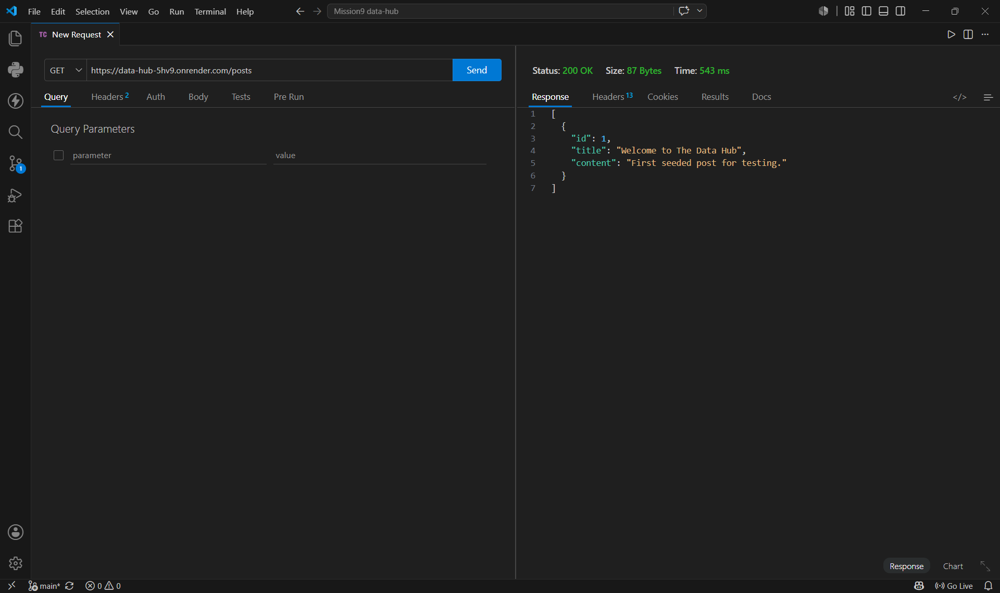
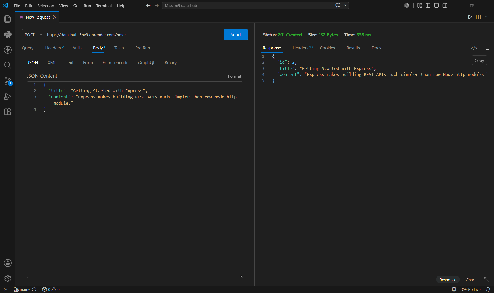
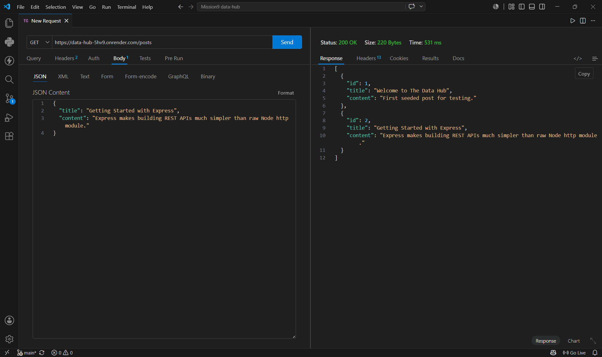
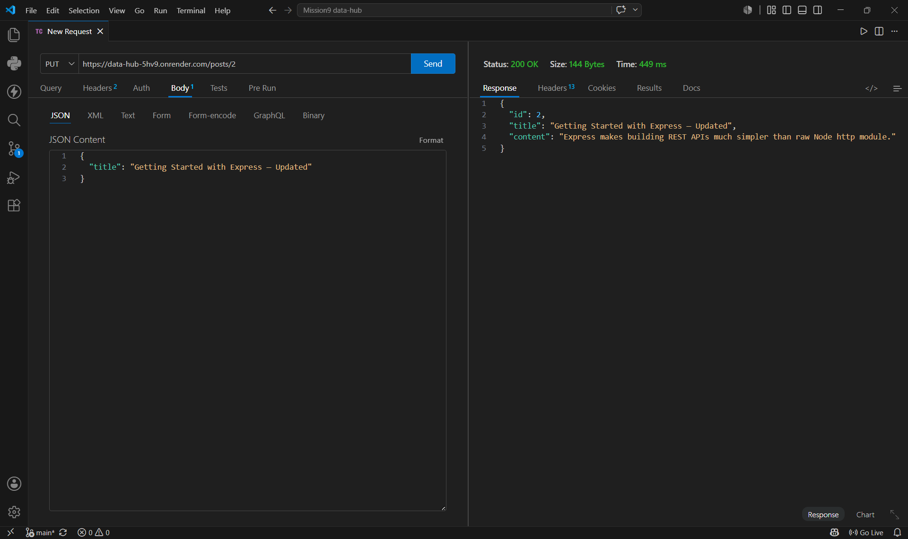
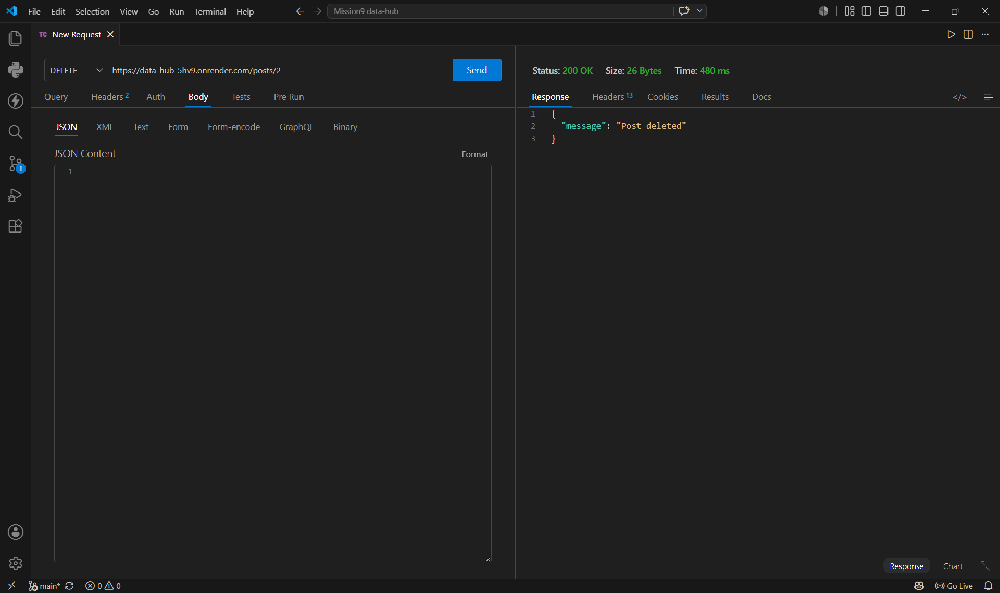
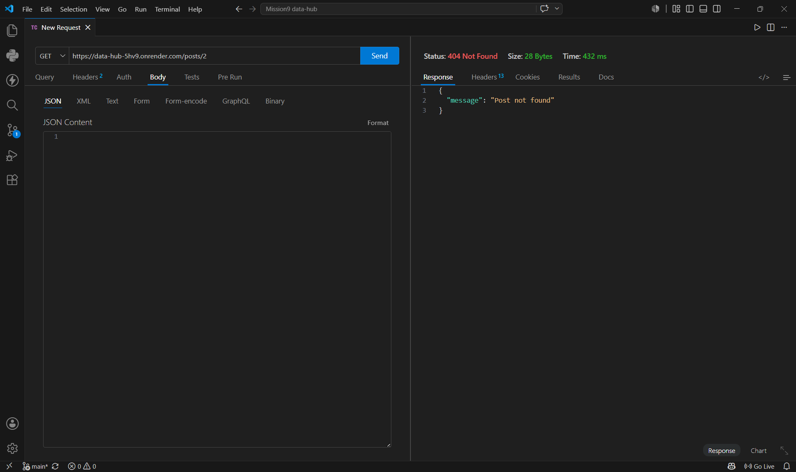
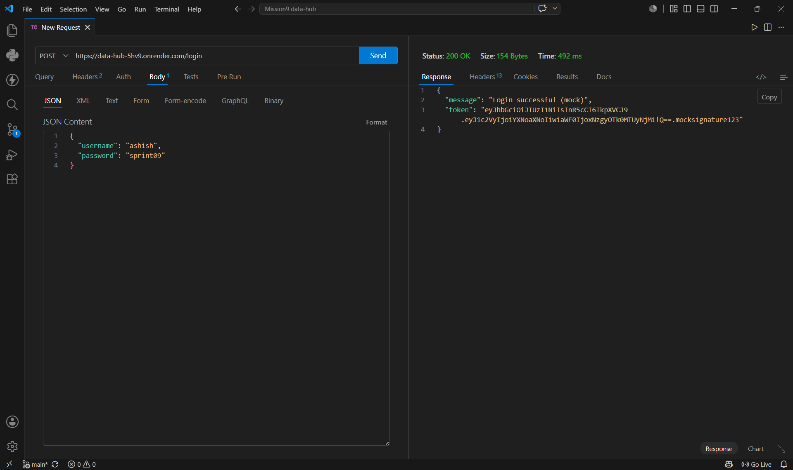

# The Data Hub
A small Express REST API server for a mock Blog resource. In-memory storage for now, custom request logging middleware, and a mock login endpoint that hands back a JWT-shaped token.

**GET /posts — initial state**



**POST /posts — create a new post**



**GET /posts — after creating**



**PUT /posts/2 — update post**



**DELETE /posts/2 — delete post**



**GET /posts — confirms deletion**



**POST /login — mock JWT token**



## Project structure

```
data-hub/
├── server.js              # app setup, mounts middleware + routes, starts on port 5000
├── routes/
│   ├── posts.js           # all 5 CRUD endpoints for the Blog resource
│   └── auth.js            # mock /login endpoint
├── middleware/
│   └── logger.js          # logs method + path + timestamp for every request
├── Prompts.md             # debugging log
└── README.md              # description
```

## Endpoints

| Method | Route        | Description              |
|--------|--------------|---------------------------|
| GET    | /posts       | Get all posts             |
| GET    | /posts/:id   | Get a single post by id   |
| POST   | /posts       | Create a new post         |
| PUT    | /posts/:id   | Update an existing post   |
| DELETE | /posts/:id   | Delete a post              |
| POST   | /login       | Mock login, returns fake JWT |

## Testing in Postman / Thunder Client

**Get all posts**
```
GET /posts
```

**Create a post**
```
POST /posts
Body (JSON):
{
  "title": "My first post",
  "content": "Testing the API"
}
```

**Update a post**
```
PUT /posts/1
Body (JSON):
{
  "title": "Updated title"
}
```

**Delete a post**
```
DELETE /posts/1
```

**Mock login**
```
POST /login
Body (JSON):
{
  "username": "ashish",
  "password": "anything"
}
```

**Live API:** https://data-hub-5hv9.onrender.com

**Repo:** https://github.com/ashish-bisht-iot/data-hub