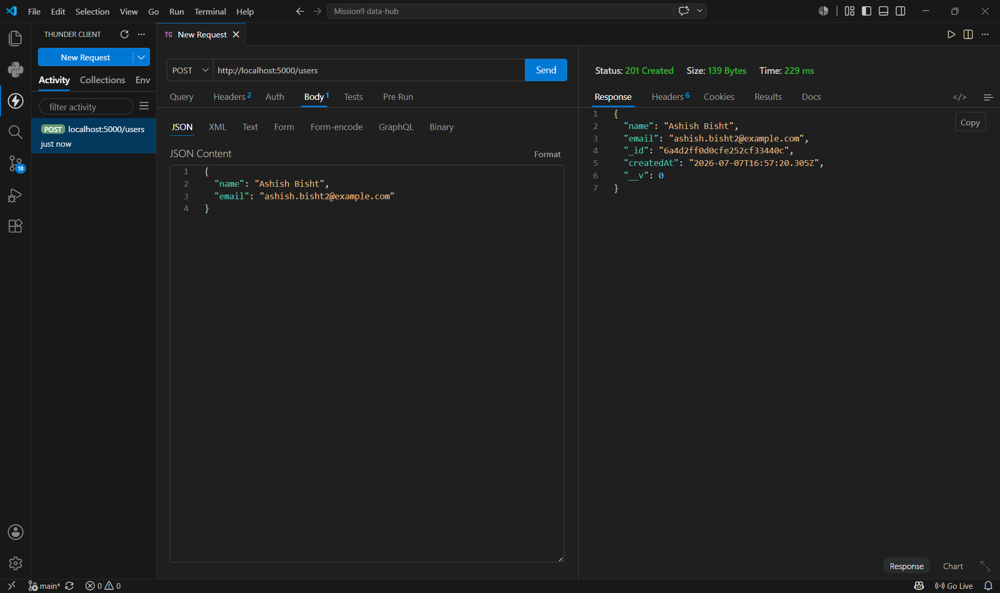
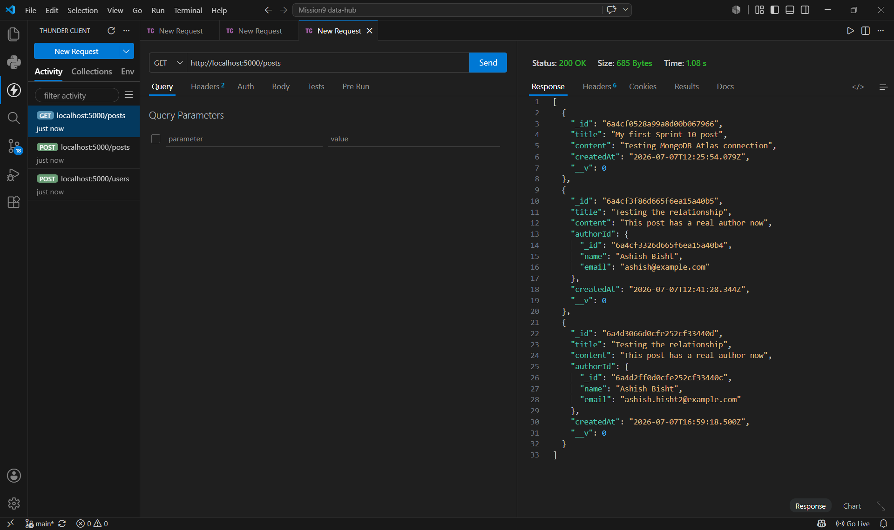
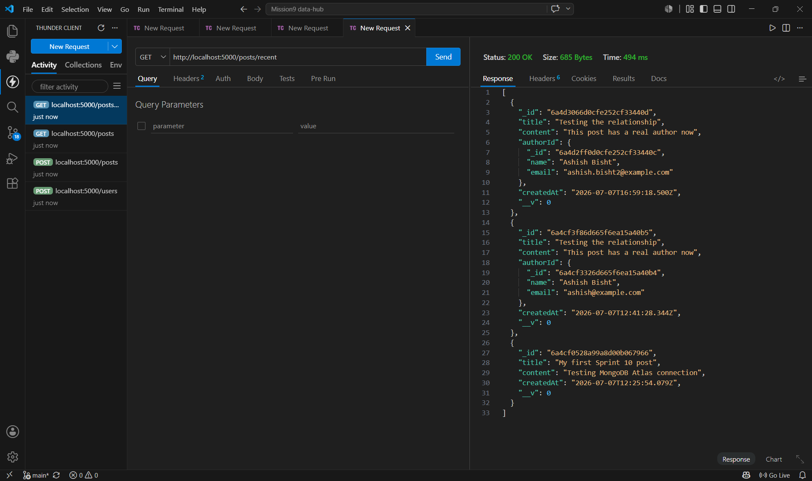
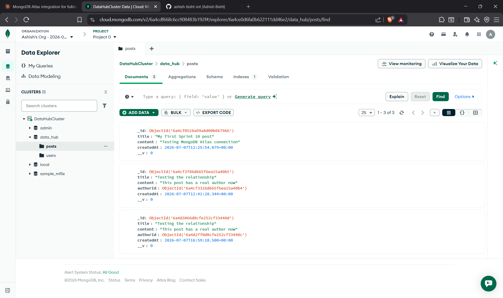
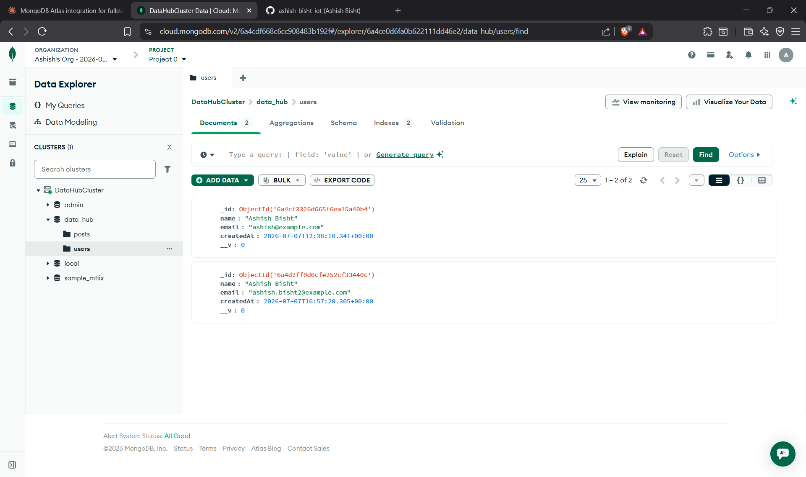

# The Data Hub
An Express REST API for a Blog/Post resource, now backed by MongoDB Atlas via Mongoose instead of an in-memory array. Includes relational modeling (Post → User via `authorId`), a `.populate()`-hydrated author on read, a recent-posts aggregation route, and custom request logging middleware.

## What changed since Sprint 09

Sprint 09 stored posts in a plain JS array, so all data vanished on every server restart. Sprint 10 replaces that with a live MongoDB Atlas cluster (M0 free tier), connected through Mongoose. Posts now persist across restarts and deployments, and each post references a real User document.

**POST /users — create an author**



**POST /posts — create a post with authorId**


**GET /posts — authorId populated with full user data**



**GET /posts/recent — top 3 most recent, populated**



**MongoDB Atlas — posts collection (raw authorId reference)**



**MongoDB Atlas — users collection**



## Project structure

```
data-hub/
├── server.js              # app setup, connects to MongoDB, mounts middleware + routes
├── db.js                  # Mongoose connection to Atlas
├── models/
│   ├── Post.js             # Post schema (title, content, authorId ref, createdAt)
│   └── User.js             # User schema (name, email, createdAt)
├── routes/
│   ├── posts.js             # CRUD + /posts/recent aggregation, .populate() on read
│   ├── users.js              # create/list users
│   └── auth.js                # mock /login endpoint
├── middleware/
│   └── logger.js               # logs method + path + timestamp for every request
├── .env                          # MONGO_URI, PORT (not committed)
├── .env.example                   # placeholder template for MONGO_URI
├── Prompts.md                      # debugging log
└── README.md                        # this file
```

## Endpoints

| Method | Route          | Description                                          |
|--------|----------------|-------------------------------------------------------|
| GET    | /posts         | Get all posts, author populated                      |
| GET    | /posts/:id     | Get a single post by id, author populated             |
| GET    | /posts/recent  | Get the 3 most recent posts, sorted, author populated |
| POST   | /posts         | Create a new post (requires title, content, authorId) |
| PUT    | /posts/:id     | Update an existing post                                |
| DELETE | /posts/:id     | Delete a post                                          |
| POST   | /users         | Create a new user (name, email)                        |
| GET    | /users         | List all users                                          |
| POST   | /login         | Mock login, returns fake JWT                            |

## Database

- **Provider:** MongoDB Atlas (M0 free tier)
- **ODM:** Mongoose
- **Database name:** `data_hub`
- **Collections:** `posts`, `users`
- **Relationship:** each `Post.authorId` references a `User._id`. Reading a post via the API hydrates that reference into the full user object via `.populate("authorId", "name email")`. Viewed directly in Atlas, `authorId` shows only the raw `ObjectId` — the populated view only happens through the API layer.

## Testing in Thunder Client

**Create a user first (required before creating a post)**
```
POST /users
Body (JSON):
{
  "name": "Ashish Bisht",
  "email": "ashish@example.com"
}
```
Copy the `_id` from the response.

**Create a post**
```
POST /posts
Body (JSON):
{
  "title": "My first post",
  "content": "Testing the API",
  "authorId": "PASTE_USER_ID_HERE"
}
```

**Get all posts / recent posts**
```
GET /posts
GET /posts/recent
```

**Update / delete a post**
```
PUT /posts/:id
DELETE /posts/:id
```

## Environment variables

Create a `.env` file with:
```
MONGO_URI="your_atlas_connection_string"
PORT=5000
```

**Live API:** https://data-hub-5hv9.onrender.com

**Repo:** https://github.com/ashish-bisht-iot/data-hub
